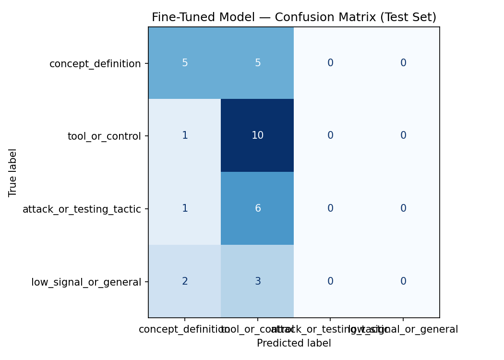

# AI Security Discussion Classifier

Author: [Ryan DeJong](https://github.com/ryandej)

## Overview

This project is a practical AI security classification study. I built a dataset of public AI security discussions, trained a small machine learning model to sort those discussions into categories, and compared its performance against a stronger AI model used as a baseline.

The project focuses on AI security topics, including prompt injection, RAG security, AI agents, red-team testing, tool misuse, guardrails, and security controls.

The goal was to understand how well a trained classifier could recognize different types of AI security discussion, where it made mistakes, and what those mistakes reveal about model behavior, data quality, and label design.

## Skills Demonstrated

This project demonstrates hands-on experience with:

* **AI Security Engineering** - worked with examples involving prompt injection, RAG security, AI agents, tool misuse, guardrail bypasses, red-team testing, and security controls.

* **Machine Learning Model Training** - trained a DistilBERT text classification model to sort AI security discussions into custom categories.

* **Model Evaluation** - measured model performance using accuracy, precision, recall, F1-score, and a confusion matrix.

* **Baseline Testing** - compared the trained model against a stronger AI model that classified the same examples using only instructions, not extra training.

* **Dataset Creation and Labeling** - built a 218-example labeled dataset with text, labels, sources, URLs, and notes explaining the labeling decisions.

* **Data Quality Control** - created and used a Python validation script to check required columns, valid labels, missing values, source URLs, short examples, and duplicate rows.

* **Label Taxonomy Design** - designed clear categories for separating concept explanations, tools or controls, attack/testing tactics, and low-quality discussion.

* **AI Red-Team Thinking** - analyzed examples involving adversarial behavior, prompt injection, unauthorized tool use, guardrail bypasses, and attack/testing methods.

* **Error Analysis** - reviewed incorrect predictions and explained why the model confused certain AI security categories.

* **Python and Colab Workflow** - used Python, Google Colab, and a T4 GPU runtime to validate data, train the model, run evaluations, and export results.

* **Technical Communication** - documented the project clearly for course review, public GitHub portfolio use, and recruiter review.

## How It Works

The classifier takes a short AI security post or comment and predicts what type of information it provides.

The four labels are:

* `concept_definition` - explains an AI security concept, risk, or system behavior.
* `tool_or_control` - discusses a security tool, framework, mitigation, scanner, monitoring method, or control.
* `attack_or_testing_tactic` - describes an attack method, abuse pattern, red-team test, or misuse scenario.
* `low_signal_or_general` - covers vague, broad, opinion-based, or low-information discussion.

I created a labeled dataset from public Reddit discussions, validated the data locally with a Python script, fine-tuned a DistilBERT classifier in Google Colab, compared it against a stronger AI baseline, and analyzed the model’s failure patterns.

## Repository Contents

| File or Folder | Purpose |
|---|---|
| `planning.md` | Project planning file with community choice, label taxonomy, edge-case rules, data collection plan, evaluation plan, and AI tool usage plan. |
| `README.md` | Final project report and evaluation writeup. |
| `data/labeled_examples.csv` | Final labeled dataset with 218 examples. |
| `data/candidate_examples.csv` | Staging template used for candidate examples before adding them to the final training dataset. |
| `scripts/validate_dataset.py` | Local validation script used to check dataset structure, labels, URLs, short rows, and duplicates. |
| `evaluation_results.json` | Exported results from the Colab notebook, including baseline and fine-tuned model accuracy. |
| `confusion_matrix.png` | Confusion matrix image for the fine-tuned DistilBERT model on the test set. |

## Colab Notebook

The model training and evaluation were completed in Google Colab using the following working notebook:

[aisec-takemeter-ryan-dejong.ipynb](https://colab.research.google.com/drive/1fw7QkeJ-vguZkLPyPlWNrnbBUNcp0slb?usp=sharing)

Runtime used:

```text
T4 GPU
```

## Community Choice

I chose public Reddit discussions about AI Security Engineering.

The dataset focuses on public discussions involving:

- LLM security,
- prompt injection,
- indirect prompt injection,
- RAG security,
- AI agents,
- MCP/tool access,
- AI red teaming,
- adversarial machine learning,
- AI-generated code security,
- data poisoning,
- credential brokering,
- authorization controls,
- model monitoring,
- secure AI deployment.

Example source communities included:

- `r/cybersecurity`
- `r/LocalLLaMA`
- `r/netsec`
- `r/MachineLearning`
- `r/LLM`

These are a good fit because AI security discussions contain several different types of discourse. Some posts explain concepts, some recommend tools or controls, some describe attacks or testing tactics, and some are broad or low-signal. That made the community appropriate for a multi-class text classification project.

I used public Reddit discussions only. I did not use private messages, private Discord servers, private forums, or non-public content.

## Classification Labels

### 1. `concept_definition`

This label is used when the text defines, explains, or clarifies an AI security engineering term, concept, risk, model behavior, system design issue, or architecture pattern.

Example:

> Prompt injection happens when untrusted text causes a model to follow attacker-controlled instructions instead of the intended system instructions.

Example:

> Local deployment removes a cloud server from the path, but it does not automatically solve logging, tool access, or prompt-injection risks.

Why this label exists:

This category captures learning-oriented explanations. The text does not need to recommend a specific tool or describe an attack step. The main purpose is to explain what something means or why it matters.

### 2. `tool_or_control`

This label is used when the text discusses a specific tool, framework, benchmark, mitigation, guardrail, policy, monitoring method, authorization method, scanner, or security control.

Example:

> Garak and PyRIT can be used to automate LLM red-team testing and evaluate model behavior against prompt injection and jailbreak scenarios.

Example:

> Credential brokering gives an AI agent the result of an authenticated API call without giving the agent the credential itself.

Why this label exists:

This category captures defensive, operational, and implementation-focused content. If the main purpose of the text is to name, recommend, compare, or describe a tool/control, it belongs here.

### 3. `attack_or_testing_tactic`

This label is used when the text describes a specific attack technique, abuse pattern, exploit path, red-team method, testing tactic, adversarial behavior, or misuse scenario.

Example:

> An attacker can hide malicious instructions inside retrieved documents so a RAG system treats those instructions as trusted context.

Example:

> Context overflow attacks try to bury or override earlier instructions by flooding the prompt.

Why this label exists:

This category captures adversarial behavior and security testing. The text may mention tools or controls, but the main function is describing what an attacker or tester does.

### 4. `low_signal_or_general`

This label is used when the text is vague, broad, speculative, opinion-based, promotional, career-focused, dismissive, or too general to teach a concrete AI security concept, tool, control, attack, or testing method.

Example:

> AI security is going to be huge, and everyone should learn it now.

Example:

> The funfact is that the ai stuff will bring more vulns in products.

Why this label exists:

This category prevents vague AI/security comments from being forced into a technical category. It separates real learning content from broad commentary.

## Edge-Case Rules

Some examples could fit multiple labels. To keep labels consistent, I used this priority order:

1. `attack_or_testing_tactic`
2. `tool_or_control`
3. `concept_definition`
4. `low_signal_or_general`

Decision rules:

- If the text describes an attack, exploit path, bypass, red-team test, or adversarial behavior, I label it `attack_or_testing_tactic`.
- If the text mainly discusses a tool, framework, mitigation, scanner, benchmark, monitoring method, or authorization control, I label it `tool_or_control`.
- If the text mainly explains what a term, risk, or architecture pattern means, I label it `concept_definition`.
- If the text is too broad or vague to teach something specific, I label it `low_signal_or_general`.

## Difficult Labeling Cases

### Difficult Case 1

Text:

> OWASP ranks prompt injection #1 in their LLM Top 10, An indirect injection in a retrieved document can trigger tool calls, exfiltrate data, or escalate privileges.

Possible labels:

- `tool_or_control`
- `attack_or_testing_tactic`

Final label:

```text
attack_or_testing_tactic
```

Reason:

The text mentions OWASP LLM Top 10, which sounds like a framework/control signal. However, the main content describes indirect injection causing tool calls, data exfiltration, and privilege escalation. That is attack behavior, so I labeled it as an attack/testing tactic.

### Difficult Case 2

Text:

> Prompt injection scanners that use another LLM to judge intent create a second model layer that also needs to be secured.

Possible labels:

- `concept_definition`
- `tool_or_control`

Final label:

```text
tool_or_control
```

Reason:

The text explains a limitation of LLM-based detection, but the main subject is a scanner/detection method. Because the text discusses how a control works and what risk it introduces, I labeled it as `tool_or_control`.

### Difficult Case 3

Text:

> Saying prompt injection is impossible to detect is too broad; practical systems can still monitor intent, tool calls, outputs, and permissions.

Possible labels:

- `low_signal_or_general`
- `tool_or_control`

Final label:

```text
low_signal_or_general
```

Reason:

The text mentions monitoring intent, tool calls, outputs, and permissions, but it is framed as a broad response to pessimism rather than a concrete implementation. I labeled it as low-signal/general because it does not provide enough implementation detail.

## Dataset

The final dataset is located at:

```text
data/labeled_examples.csv
```

The dataset contains:

```text
218 labeled examples
```

Each row includes five columns:

| Column | Purpose |
|---|---|
| `text` | The post/comment text or normalized excerpt used for classification. |
| `label` | The final label assigned to the example. |
| `source` | The subreddit and thread/context where the example came from. |
| `source_url` | The public Reddit URL associated with the example. |
| `notes` | A short note explaining why the label was assigned. |

The Colab notebook uses the `text` and `label` columns for model training and evaluation. The `source`, `source_url`, and `notes` columns support traceability and manual review.

## Dataset Collection Process

The dataset was built in phases.

1. I selected a public AI Security Engineering community focus.
2. I defined a four-label taxonomy before training.
3. I created `data/labeled_examples.csv` with the required `text` and `label` columns, plus documentation columns.
4. I added public Reddit examples in batches.
5. I validated the CSV after each major batch.
6. I corrected duplicate rows, short rows, and malformed CSV rows before continuing.
7. I uploaded the final validated CSV to Colab.

The dataset grew through these checkpoints:

| Checkpoint | Status |
|---|---|
| Pilot dataset | 8 examples |
| First expanded dataset | 25 examples |
| Midpoint dataset | about 150 examples |
| Final dataset | 218 examples |

## Label Distribution

| Label | Count |
|---|---:|
| `tool_or_control` | 74 |
| `concept_definition` | 65 |
| `attack_or_testing_tactic` | 47 |
| `low_signal_or_general` | 32 |
| **Total** | **218** |

The dataset is not perfectly balanced, but no single label dominates the dataset. The largest class, `tool_or_control`, represents about 34% of all examples.

## Dataset Validation

I created a validation script:

```text
scripts/validate_dataset.py
```

The script checks:

- required columns,
- valid label names,
- missing text,
- missing source values,
- missing source URLs,
- missing notes,
- non-Reddit source URLs,
- very short examples,
- duplicate text rows,
- malformed CSV rows with extra values.

Final local validation result:

```text
Dataset validation report
==============================
Total rows: 218
Columns: ['text', 'label', 'source', 'source_url', 'notes']

Label distribution:
- attack_or_testing_tactic: 47
- concept_definition: 65
- low_signal_or_general: 32
- tool_or_control: 74

Problems found:
No technical problems found.
```

This validation step was important because the model training notebook depends on the CSV being readable and on every label matching the defined label map.

## Model and Fine-Tuning Setup

The model used was:

```text
distilbert-base-uncased
```

Task type:

```text
Sequence classification
```

Number of labels:

```text
4
```

The label map used in Colab was:

```python
LABEL_MAP = {
    "concept_definition": 0,
    "tool_or_control": 1,
    "attack_or_testing_tactic": 2,
    "low_signal_or_general": 3,
}
```

The notebook confirmed that all labels in the CSV matched the label map.

## Train / Validation / Test Split

The starter notebook split the 218 examples into train, validation, and test sets using a stratified split.

| Split | Count |
|---|---:|
| Train | 152 |
| Validation | 33 |
| Test | 33 |

The test label distribution was:

| Test Label | Count |
|---|---:|
| `tool_or_control` | 11 |
| `concept_definition` | 10 |
| `attack_or_testing_tactic` | 7 |
| `low_signal_or_general` | 5 |

The test set was used for both the fine-tuned DistilBERT model and the Groq baseline so the comparison would be fair.

## Hyperparameters

I used the starter notebook’s default hyperparameters.

| Hyperparameter | Value |
|---|---:|
| Epochs | 3 |
| Learning rate | 2e-5 |
| Train batch size | 16 |
| Evaluation batch size | 32 |
| Weight decay | 0.01 |
| Warmup steps | 50 |
| Evaluation strategy | epoch |
| Save strategy | epoch |
| Best model metric | accuracy |

I kept the defaults because the notebook notes that they are appropriate for datasets around 100–500 examples, and my dataset had 218 examples. I did not increase the number of epochs because a small dataset can overfit if trained too aggressively.

## Fine-Tuning Result

Fine-tuning completed successfully in Colab.

Final test-set evaluation:

```text
Fine-tuned DistilBERT accuracy: 0.455
```

Fine-tuned per-class metrics:

| Label | Precision | Recall | F1-score | Support |
|---|---:|---:|---:|---:|
| `concept_definition` | 0.56 | 0.50 | 0.53 | 10 |
| `tool_or_control` | 0.42 | 0.91 | 0.57 | 11 |
| `attack_or_testing_tactic` | 0.00 | 0.00 | 0.00 | 7 |
| `low_signal_or_general` | 0.00 | 0.00 | 0.00 | 5 |
| **Accuracy** |  |  | **0.45** | 33 |
| **Macro avg** | 0.24 | 0.35 | 0.27 | 33 |
| **Weighted avg** | 0.31 | 0.45 | 0.35 | 33 |

The fine-tuned model learned some useful signal for `concept_definition` and `tool_or_control`, but it failed to correctly predict `attack_or_testing_tactic` and `low_signal_or_general` on the test set.

## Baseline Classifier

The baseline was a zero-shot Groq classifier using:

```text
llama-3.3-70b-versatile
```

The Groq prompt included:

- the community,
- the task,
- four valid labels,
- one definition per label,
- one example per label,
- the edge-case priority rule,
- an instruction to output only the label name.

The Groq baseline classified the same 33-example test set used by the fine-tuned model.

## Baseline Result

Groq baseline accuracy:

```text
0.788
```

Baseline per-class metrics:

| Label | Precision | Recall | F1-score | Support |
|---|---:|---:|---:|---:|
| `concept_definition` | 0.69 | 0.90 | 0.78 | 10 |
| `tool_or_control` | 1.00 | 0.73 | 0.84 | 11 |
| `attack_or_testing_tactic` | 0.67 | 0.86 | 0.75 | 7 |
| `low_signal_or_general` | 1.00 | 0.60 | 0.75 | 5 |
| **Accuracy** |  |  | **0.79** | 33 |
| **Macro avg** | 0.84 | 0.77 | 0.78 | 33 |
| **Weighted avg** | 0.84 | 0.79 | 0.79 | 33 |

The Groq baseline performed much better across all four labels, especially on the two labels that the fine-tuned DistilBERT model missed.

## Model Comparison

| Model | Accuracy |
|---|---:|
| Zero-shot baseline (Groq) | 0.788 |
| Fine-tuned DistilBERT | 0.455 |

Fine-tuning regression:

```text
0.333
```

The zero-shot Groq baseline performed 33.3 percentage points better than the fine-tuned DistilBERT model.

## Exported Results

The notebook exported:

```text
evaluation_results.json
confusion_matrix.png
```

The exported `evaluation_results.json` contains the final comparison values:

```json
{
  "baseline_accuracy": 0.7879,
  "finetuned_accuracy": 0.4545,
  "improvement": -0.3333,
  "test_set_size": 33,
  "label_map": {
    "concept_definition": 0,
    "tool_or_control": 1,
    "attack_or_testing_tactic": 2,
    "low_signal_or_general": 3
  },
  "model": "distilbert-base-uncased"
}
```

## Confusion Matrix

### Confusion Matrix Table

Rows are the true labels. Columns are the model’s predicted labels.

| True Label | Predicted `concept_definition` | Predicted `tool_or_control` | Predicted `attack_or_testing_tactic` | Predicted `low_signal_or_general` |
|---|---:|---:|---:|---:|
| `concept_definition` | 5 | 5 | 0 | 0 |
| `tool_or_control` | 1 | 10 | 0 | 0 |
| `attack_or_testing_tactic` | 1 | 6 | 0 | 0 |
| `low_signal_or_general` | 2 | 3 | 0 | 0 |

This table shows the same pattern as the confusion matrix image. The fine-tuned model mostly predicted `concept_definition` and `tool_or_control`. It did not predict `attack_or_testing_tactic` or `low_signal_or_general` on the test set, which explains the low F1-scores for those two labels.

The confusion matrix image is included in this repository:

```text
confusion_matrix.png
```



The confusion matrix showed that the fine-tuned model mostly predicted:

- `concept_definition`
- `tool_or_control`

It did not predict:

- `attack_or_testing_tactic`
- `low_signal_or_general`

This explains the 0.00 F1-scores for those two labels.

## Sample Classifications from the Fine-Tuned Model

The demo cell in the Colab notebook classified five new AI security examples. The table below shows the expected label, predicted label, confidence score, and whether the prediction was correct.

| Example | Expected Label | Predicted Label | Confidence | Correct? | Explanation |
|---|---|---|---:|---|---|
| Prompt injection definition | `concept_definition` | `tool_or_control` | 0.360 | No | The text defines prompt injection, but the model over-predicted `tool_or_control`. |
| Garak and PyRIT tools | `tool_or_control` | `tool_or_control` | 0.349 | Yes | The text names specific tools used for LLM red-team testing, so `tool_or_control` is the correct label. |
| Malicious instructions in RAG document | `attack_or_testing_tactic` | `tool_or_control` | 0.365 | No | The text describes an attack path, but the model again predicted `tool_or_control`. |
| Broad AI security statement | `low_signal_or_general` | `concept_definition` | 0.283 | No | The text is broad and does not teach a concrete concept, but the model treated it as a concept definition. |
| Unauthorized tool-use testing | `attack_or_testing_tactic` | `tool_or_control` | 0.330 | No | The text describes testing for misuse, but the model focused on the words “tool” and “guardrails.” |

This sample classification table supports the demo video requirement because it shows example inputs, predicted labels, confidence scores, and an explanation of one correct and multiple incorrect predictions.

## Error Analysis

The fine-tuned model made:

```text
18 wrong predictions out of 33
```

The wrong-prediction examples showed that the model often over-predicted `tool_or_control`.

### Failure Example 1

Text:

> OWASP ranks prompt injection #1 in their LLM Top 10, An indirect injection in a retrieved document can trigger tool calls, exfiltrate data, or escalate privileges.

True label:

```text
attack_or_testing_tactic
```

Predicted label:

```text
tool_or_control
```

Confidence:

```text
0.28
```

Analysis:

The model likely focused on the phrase “OWASP ranks prompt injection #1 in their LLM Top 10,” which sounds like a framework/control signal. However, the main content describes an indirect injection causing tool calls, exfiltration, and privilege escalation. That is an attack/testing tactic. The model appeared to overweight framework keywords instead of the action being described.

### Failure Example 2

Text:

> I tried prompting the model at the user level to return the JSON metadata from the source documents.

True label:

```text
attack_or_testing_tactic
```

Predicted label:

```text
tool_or_control
```

Confidence:

```text
0.27
```

Analysis:

This is a testing tactic because the user is probing whether the model will leak metadata from source documents. The model predicted `tool_or_control`, likely because the text includes implementation-like terms such as “JSON metadata” and “source documents.”

### Failure Example 3

Text:

> The funfact is that the ai stuff will bring more vulns in products.

True label:

```text
low_signal_or_general
```

Predicted label:

```text
concept_definition
```

Confidence:

```text
0.27
```

Analysis:

This text is broad, informal, and opinion-based. It does not define a specific concept, name a control, or describe an attack method. The model likely saw words like “AI,” “vulns,” and “products” and treated the text as a concept explanation, even though the statement had low technical value.

### Failure Example 4

Text:

> Testing AI agents should include attempts to hijack workflows, bypass guardrails, and force unauthorized tool use.

True label:

```text
attack_or_testing_tactic
```

Predicted label:

```text
tool_or_control
```

Confidence:

```text
0.27
```

Analysis:

This example directly describes red-team testing actions: hijacking workflows, bypassing guardrails, and forcing unauthorized tool use. The model likely predicted `tool_or_control` because the text includes “guardrails” and “tool use,” which are strongly associated with controls. This shows the model struggled when attack/testing examples contained control-related vocabulary.

### Failure Example 5

Text:

> McpVanguard is described as a real-time AI security proxy for MCP agents.

True label:

```text
tool_or_control
```

Predicted label:

```text
concept_definition
```

Confidence:

```text
0.27
```

Analysis:

The correct label is `tool_or_control` because the text names a security proxy. The model predicted `concept_definition`, possibly because the phrase “is described as” resembles a definition. This shows that the model sometimes focused on sentence form rather than the technical function of the content.

## Interpretation

The fine-tuned DistilBERT model underperformed the Groq baseline.

The main reasons appear to be:

1. **The task requires semantic judgment.**  
   The labels are not simple topic labels. The model must understand whether a post is functioning as a concept explanation, a defensive/control recommendation, an attack/testing description, or a low-signal statement.

2. **The dataset was small for the complexity of the task.**  
   Although 218 examples meets the project requirement, it is still a small dataset for teaching subtle distinctions between similar technical categories.

3. **The dataset was not perfectly balanced.**  
   `tool_or_control` had 74 examples, while `low_signal_or_general` had 32 examples. The fine-tuned model over-predicted `tool_or_control`, which may reflect both imbalance and keyword overlap.

4. **The labels share vocabulary.**  
   Attack examples often mention tools, controls, frameworks, testing, and guardrails. The model sometimes treated attack/testing examples as `tool_or_control` because of overlapping keywords.

5. **The baseline had the full label instructions at inference time.**  
   The Groq baseline saw the label definitions, examples, and priority rule every time it classified a post. DistilBERT had to learn those rules from the dataset.

## What the Fine-Tuned Model Learned

The fine-tuned model learned some domain signal. It recognized many examples involving tools, controls, and concept explanations.

It learned:

- AI security posts with tools/frameworks often belong to `tool_or_control`;
- explanatory posts often belong to `concept_definition`.

It did not reliably learn:

- when a text describes an attack or testing tactic;
- when a text is broad, vague, or low-signal;
- how to ignore misleading keywords and focus on the function of the text.

## What I Intended the Model to Learn

I intended the model to learn the functional difference between four kinds of AI Security Engineering discourse:

1. explanation of a concept,
2. discussion of a tool/control,
3. description of an attack/testing tactic,
4. low-signal or general commentary.

The model partially learned this taxonomy but collapsed many examples into `concept_definition` and `tool_or_control`.

## What I Would Improve

If I continued improving this project, I would:

1. Add more `attack_or_testing_tactic` examples.
2. Add more `low_signal_or_general` examples.
3. Balance the dataset closer to 50–60 examples per label.
4. Add contrast pairs where two examples share keywords but have different labels.
5. Add more short, realistic low-signal examples so the model learns that AI/security keywords alone are not enough.
6. Rewrite label notes to better distinguish “tool/control” from “attack/testing tactic.”
7. Try a larger model or a transformer better suited for nuanced semantic classification.
8. Evaluate whether a two-stage classifier works better:
   - stage 1: technical vs. low-signal,
   - stage 2: concept vs. control vs. tactic.

## Project Reflection

This project showed that fine-tuning is not automatically better than prompting a strong baseline model. My fine-tuned DistilBERT model performed worse than the Groq baseline because the task required nuanced understanding of AI security meaning.

The most useful part of the project was the failure analysis. The confusion matrix and wrong predictions showed that the model over-predicted `tool_or_control` and struggled with `attack_or_testing_tactic` and `low_signal_or_general`. This helped me understand the difference between labels that make sense to a human and labels that a small model can learn from a limited dataset.

The project also showed the value of dataset validation. Small CSV errors, duplicate examples, short rows, or label mismatches can create problems later in the notebook. Building and using a validation script made the project more reliable.

## AI Tool Usage and Human Review

I used AI assistance during this project, but I did not accept AI output automatically. I used it as a support tool for brainstorming, drafting, debugging, and analysis, while making the final project decisions myself.

| Area | How AI Helped | What I Reviewed, Revised, or Overrode |
|---|---|---|
| Topic selection | Helped brainstorm possible TakeMeter communities and classification tasks. | I chose AI Security Engineering because it aligned with my cybersecurity and AI interests. |
| Label taxonomy | Suggested possible label names and edge-case rules. | I revised the labels to avoid vague categories like “good” or “bad” and chose labels tied to AI security knowledge type. |
| Dataset creation | Helped structure CSV rows and labeling notes. | I reviewed the labels, kept the four-label taxonomy consistent, and used validation checks before training. |
| Validation script | Helped draft the Python validator. | I tested the script locally and used it repeatedly while expanding the dataset. |
| Colab notebook workflow | Helped identify which starter notebook cells needed editing. | I ran the notebook myself, confirmed outputs, and used the actual metrics in the README. |
| Evaluation analysis | Helped interpret the confusion matrix and wrong predictions. | I based the final analysis on the actual model outputs, not on expected or ideal results. |
| README drafting | Helped organize the final report. | I revised the README to make it clearer for course review, public GitHub use, and recruiter review. |
| Demo script | Helped turn the project results into a short spoken explanation. | I adjusted the script to sound natural and to explain the project in plain language. |

The most important human decision was keeping the negative result instead of hiding it. The fine-tuned model underperformed the stronger AI baseline, and I documented that honestly because the failure pattern was useful evidence about model reliability.

## Reproduction Steps

### 1. Clone the repo

```bash
git clone https://github.com/ryandej/aisec-takemeter-ryan-dejong.git
cd aisec-takemeter-ryan-dejong
```

### 2. Validate the dataset locally

```bash
python scripts/validate_dataset.py
```

Expected result:

```text
Total rows: 218
Problems found:
No technical problems found.
```

### 3. Open the Colab notebook

Open:

[TakeMeter_AI_Security_Ryan_DeJong.ipynb](https://colab.research.google.com/drive/1fw7QkeJ-vguZkLPyPlWNrnbBUNcp0slb?usp=sharing)

### 4. Set the runtime

In Colab:

```text
Runtime → Change runtime type → T4 GPU → Save
```

### 5. Upload the dataset

Upload:

```text
data/labeled_examples.csv
```

### 6. Run notebook sections in order

1. Install dependencies.
2. Import libraries.
3. Define `LABEL_MAP`.
4. Upload and validate CSV.
5. Split dataset.
6. Tokenize examples.
7. Load DistilBERT.
8. Fine-tune the model.
9. Evaluate the fine-tuned model.
10. Generate `confusion_matrix.png`.
11. Run Groq baseline.
12. Compare results.
13. Export `evaluation_results.json`.

## Final Results Summary

| Item | Result |
|---|---:|
| Dataset size | 218 examples |
| Labels | 4 |
| Train examples | 152 |
| Validation examples | 33 |
| Test examples | 33 |
| Fine-tuned DistilBERT accuracy | 0.455 |
| Groq baseline accuracy | 0.788 |
| Difference | Baseline better by 0.333 |

## Spec Reflection

The original project spec required a clear community, 2–4 labels, a 200+ example dataset, a fine-tuning pipeline, a baseline comparison, an evaluation report, and a demo. Building the project against those requirements helped keep the work structured.

The most useful part of the spec was the requirement to define labels before training. That forced me to think carefully about the difference between a concept explanation, a tool/control, an attack/testing tactic, and low-signal discussion. Without that step, it would have been easy to create vague labels that were hard to evaluate.

The baseline comparison was also important. If I only reported the fine-tuned model accuracy, I might have treated 45.5% as the final result without context. Comparing it to the stronger AI baseline showed that the fine-tuned model was not reliable enough yet.

The main thing I would improve in my own spec is the success threshold. I should have stated a concrete target before training, such as: “The fine-tuned model should reach at least 70% accuracy or come within 10 percentage points of the baseline.” My final model did not meet that threshold, but the failure analysis still made the project valuable because it showed where the model broke down.

## Confidence Calibration Reflection

The demo predictions also showed that the fine-tuned model’s confidence scores were low, even when it made a correct prediction.

| Example | Predicted Label | Confidence | Correct? |
|---|---|---:|---|
| Prompt injection definition | `tool_or_control` | 0.360 | No |
| Garak and PyRIT tools | `tool_or_control` | 0.349 | Yes |
| Malicious RAG instructions | `tool_or_control` | 0.365 | No |
| Broad AI security statement | `concept_definition` | 0.283 | No |
| Unauthorized tool-use testing | `tool_or_control` | 0.330 | No |

The model’s confidence scores were clustered between about 0.28 and 0.37. This means the model was not highly confident, even when it selected a label. In a production setting, I would not want this classifier to make automatic decisions at that confidence level.

A practical improvement would be to add a confidence threshold. For example, if the model confidence is below 0.60, the system could send the example to a human reviewer instead of automatically accepting the label.

This would make the classifier safer to use because uncertain predictions would be flagged instead of silently trusted.

## Final Thoughts

The Groq baseline outperformed the fine-tuned DistilBERT model. This does not make the project unsuccessful. Instead, it shows that the label taxonomy required nuanced semantic judgment, and a small fine-tuned model with 218 examples was not enough to fully learn those distinctions.

The final result gave me a clearer understanding of dataset design, fine-tuning limits, baseline comparison, and model error analysis in an AI Security Engineering context.
